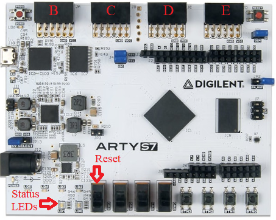
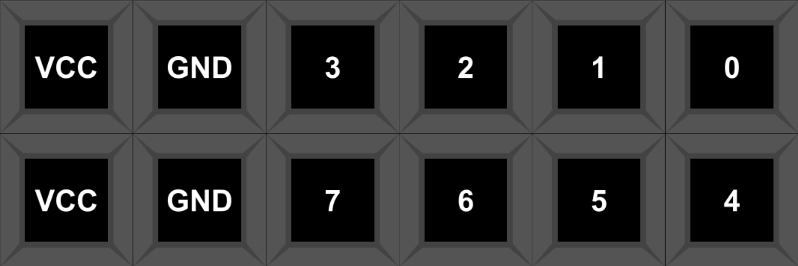
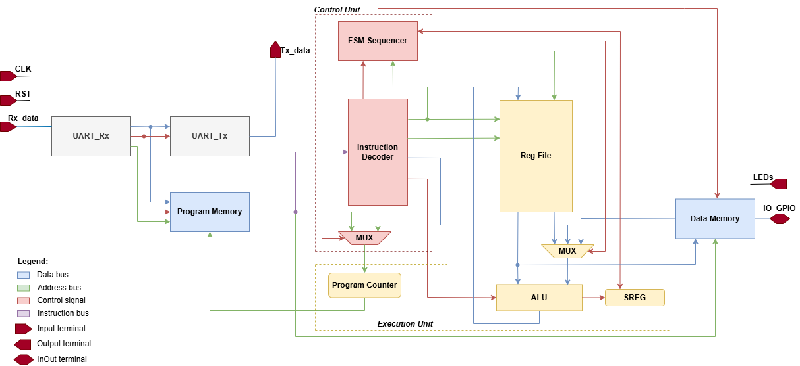

# 8-bit AVR Softcore Processor on FPGA

This project aims to design, implement in SystemVerilog, and verify a softcore processor compatible with a subset of the 8-bit AVR instruction set. The target hardware is the Digilent Arty S7-50 board with a Spartan-7 FPGA.

## Project Specifications
- 8-bit architecture.
- AVR instruction set subset (RISC) allowing the execution of programs compiled by `avr-gcc`.
- Harvard architecture – separate buses for program memory (Flash) and data memory (SRAM).
- 32 general-purpose registers (R0-R31), 12 I/O registers, 4 KB SRAM, 8 KB Flash.
- Support for I/O ports physically available on the Arty S7-50 board.
- System clock set to 12 MHz.
- Device Flash available to load the program via UART.

## CPU Overview
The CPU uses a state machine to fetch and execute instructions. 
The state machine has 4 states:
1. Fetch: Fetch instruction from Flash memory.
2. Decode: Decode instruction and fetch operands from registers.
3. Execute: Execute instruction.
4. Memory: Access data memory.

Hence most instructions are executed in 3 clock cycle. However, some instructions (STS, LDS, JMP) require more clock cycles. Using a 12 MHz clock allows execution with around 3 MIPS, which is sufficient for this project.

## Core Modules
The CPU architecture is modularized into the following functional blocks:
- **Control Unit (CU):** Contains the main instruction decoder (`instruction_decoder.sv`) and the Finite State Machine (`fsm_sequencer.sv`). It controls the datapath and generates control signals for the execution unit and memory modules, effectively managing the multi-stage execution cycle.
- **Execution Unit (EU):** Houses the Arithmetic Logic Unit (`alu.sv`), the Status Register (`sreg.sv`), and the 32 General Purpose Registers (`reg_file.sv`). It performs all arithmetic/logical operations and computes program counter (`program_counter.sv`) updates, including conditional branch evaluations.
- **Program Memory:** Implemented as a true dual-port Block RAM (BRAM), providing 8 KB of instruction storage (equivalent to AVR Flash). Port A is dedicated to synchronous instruction fetching by the CPU, while Port B allows the UART bootloader to program the memory on the fly.
- **Data Memory:** Implemented as BRAM, serving as 4 KB of general-purpose operational SRAM. It handles 8-bit read/write operations for variables and the stack, and crucially maps specific address spaces (0x0023 - 0x002E) directly to hardware physical I/O ports.
- **UART Bootloader:** An integrated hardware module allowing memory programming without re-synthesizing the FPGA bitstream. By pressing the reset button, the CPU halts execution while the UART receiver (`UART_Rx.sv`) actively listens for incoming bytes from the PC at 9600 baud. The received data is written directly to the Program Memory and simultaneously echoed back to the PC via `UART_Tx.sv` for verification. Upon releasing the reset button, the CPU fetches the newly loaded program starting from address 0x0000.

## Technologies Used
- **Hardware Description Language:** SystemVerilog
- **Environment:** Vivado ML Standard 2023.x / 2025.2
- **Target Platform:** Digilent Arty S7-50
- **Bootloader:** Custom Python 3.13 script using pyserial library

## RAM and Flash Memories (BRAM on FPGA)
Both SRAM and Flash memories are implemented using Block RAM (BRAM) on the FPGA.
- **Flash (Program Memory):**
  - 16-bit cells.
  - Synchronous read operations.
  - One port to write data over UART.
  - One port for reading instructions by the processor.
- **RAM (Operational Memory):**
  - 8-bit cells.
  - Synchronous read and write operations.
  - One port for reading data by the processor.
  - One port for writing data by the processor.
  - Adresses from 0x0023 - 0x002E reserved for I/O ports.
  - Ports are mapped to the PMOD connectors on the Arty S7-50 board:
    - PMOD JA pins 0-7 -> PORTB 0-7
    - PMOD JB pins 0-7 -> PORTC 0-7
    - PMOD JC pins 0-7 -> PORTD 0-7
    - PMOD JD pins 0-7 -> PORTE 0-7
  - Remaining adresses starting from 0x0100 are usable for general purpose memory.

## Instruction Set
**List of opcodes:**
- *Arithmetic-logic:* `ADD`, `ADC`, `SUB`, `SBC`, `AND`, `OR`, `EOR`, `COM`, `NEG`, `INC`, `DEC`
- *Shifts:* `LSR`, `ASR`, `ROR`, `ROL`, `LSL`
- *Data operations:* `MOV`, `LDI`, `LDS`, `STS`
- *Jumps and branches:* `RJMP`, `JMP`, `BREQ`, `BRNE`
- *Other:* `NOP`

## Physical Mapping

  

  

  

## Block Diagram

  

